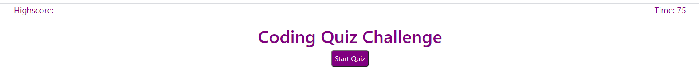
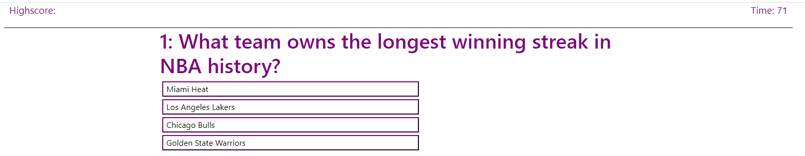
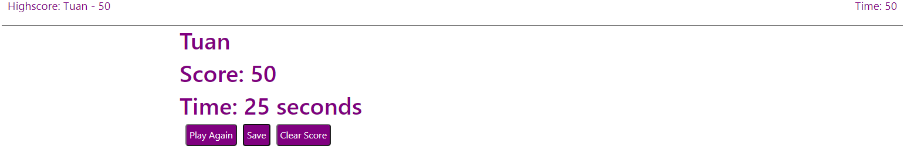

# QuizTime

Quiz game

### To start, simply click on the Start Quiz

### Instruction

After you click on "Start Quiz" you will be present a question, once you click on an answer, you are not allow to change your answer.

After click on your answer, the game will tell you wether it is a correct or incorect answer.

If you click on the incorrect answer, the time will be shorten by a certain amount.

Once time reach 0, the game will stop, displaying you're out of time.

The game will also stop once you enter all the questions.

### Once complete

Once you answer all the questions or time run out, the game will ask for your name. The game will also present your score and the time it took you to finish.

Once you submit your name, you have the option to save, which appear on the top left corner, you also have the option to clear the score.

Lastly, you have the option to play again.
